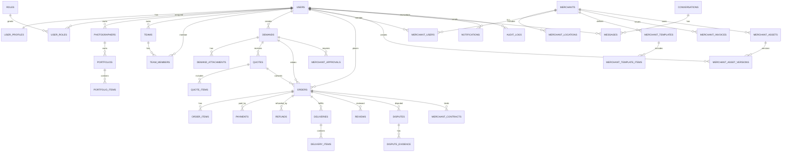

# ER 图（文本版）

```mermaid
erDiagram
  USERS ||--|| USER_PROFILES : has
  USERS ||--o{ USER_ROLES : assigned
  ROLES ||--o{ USER_ROLES : grants

  USERS ||--o{ PHOTOGRAPHERS : owns
  USERS ||--o{ TEAMS : owns
  TEAMS ||--o{ TEAM_MEMBERS : has
  USERS ||--o{ TEAM_MEMBERS : member

  PHOTOGRAPHERS ||--o{ PORTFOLIOS : owns
  PORTFOLIOS ||--o{ PORTFOLIO_ITEMS : contains

  USERS ||--o{ DEMANDS : creates
  DEMANDS ||--o{ DEMAND_ATTACHMENTS : has
  DEMANDS ||--o{ QUOTES : receives
  QUOTES ||--o{ QUOTE_ITEMS : includes

  USERS ||--o{ ORDERS : places
  QUOTES ||--o{ ORDERS : converts
  DEMANDS ||--o{ ORDERS : relates
  ORDERS ||--o{ ORDER_ITEMS : has
  ORDERS ||--o{ PAYMENTS : paid_by
  ORDERS ||--o{ REFUNDS : refunded_by

  ORDERS ||--o{ DELIVERIES : fulfills
  DELIVERIES ||--o{ DELIVERY_ITEMS : contains

  ORDERS ||--o{ REVIEWS : reviewed
  ORDERS ||--o{ DISPUTES : disputed
  DISPUTES ||--o{ DISPUTE_EVIDENCE : has

  MERCHANTS ||--o{ MERCHANT_LOCATIONS : has
  MERCHANTS ||--o{ MERCHANT_USERS : includes
  USERS ||--o{ MERCHANT_USERS : member
  MERCHANTS ||--o{ MERCHANT_TEMPLATES : defines
  MERCHANT_TEMPLATES ||--o{ MERCHANT_TEMPLATE_ITEMS : includes
  ORDERS ||--o{ MERCHANT_CONTRACTS : binds
  MERCHANTS ||--o{ MERCHANT_INVOICES : issues
  DEMANDS ||--o{ MERCHANT_APPROVALS : requires
  MERCHANTS ||--o{ MERCHANT_ASSETS : owns
  MERCHANT_ASSETS ||--o{ MERCHANT_ASSET_VERSIONS : versions
  USERS ||--o{ MERCHANT_ASSET_VERSIONS : creates

  CONVERSATIONS ||--o{ MESSAGES : has
  USERS ||--o{ MESSAGES : sends
  USERS ||--o{ NOTIFICATIONS : receives

  USERS ||--o{ AUDIT_LOGS : acts
```

> 如需可视化 PNG/SVG，我可以根据此 Mermaid 生成图。
